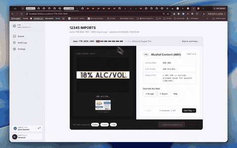
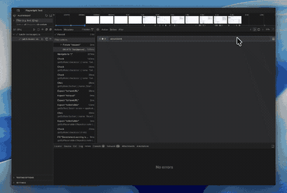
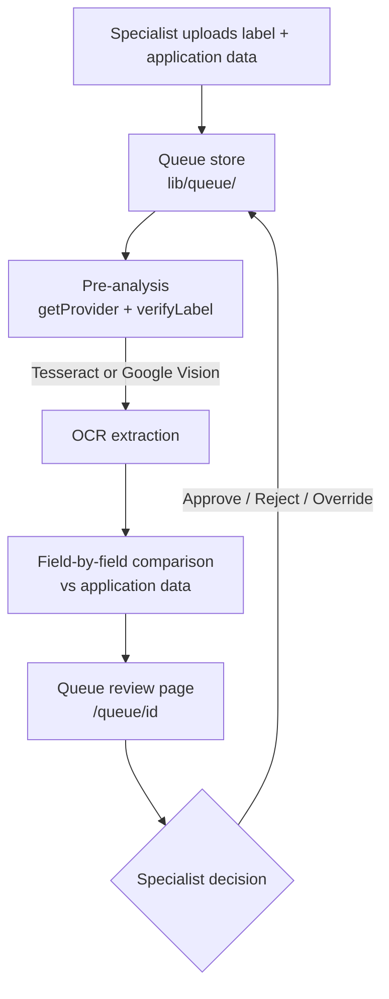

# Alcohol Label Verification System

This application helps government specialists review alcohol beverage labels for compliance with TTB (Alcohol and Tobacco Tax and Trade Bureau) regulations. It uses artificial intelligence to automatically read label information and compare it against submitted application data, reducing review time while maintaining accuracy and human oversight.

## What Problem Does It Solve?

Reviewing alcohol labels involves comparing multiple pieces of information:

- Brand name
- Product type
- Alcohol content
- Bottle size
- Bottler location
- Country of origin
- Government-required warning statement

Previously, this was a manual, time-consuming process. Specialists had to:

- Look at label images
- Manually extract information
- Type data into forms
- Compare against applications
- Document any discrepancies

This application automates the first three steps, letting specialists focus entirely on review and decision-making.

## Key Features

### Smart Recognition

- **Intelligent matching** — recognizes that "STONE'S THROW" and "Stone's Throw" refer to the same brand
- **Format flexibility** — understands that "45% ABV," "45% Alc./Vol.," and "90 Proof" are equivalent
- **Multi-image support** — reads information from front and back labels simultaneously

### Compliance Checking

- **Regulatory validation** — checks alcohol content ranges for different product types
- **Government warning verification** — requires exact matching for mandatory warning statements (no variations allowed)
- **Standard fill sizes** — confirms bottle sizes against approved standards

### Review Support

- **Clear flagging** — identifies what needs specialist review and why
- **Visual field references** — shows exactly where on the label each piece of information came from
- **Confidence indicators** — distinguishes between confident extractions and uncertain ones

### Accessibility

- **Senior-friendly design** — 28% larger text, bigger touch targets, high-contrast colors
- **No specialized training required** — straightforward interface for reviewers of all technical levels
- **Batch processing** — review multiple applications efficiently

## How It Works

1. **Upload** — Submit one or more label images (front/back pairs for alcohol bottles)
2. **Analysis** — The system automatically extracts label information using AI vision technology
3. **Comparison** — Extracted data is compared against the submitted application
4. **Review** — Specialists review flagged items and any uncertain extractions
5. **Decision** — Approve, reject, or request corrections
6. **Record** — All decisions are logged for audit purposes

## Architecture

Applications are pre-analyzed automatically as they enter the queue: OCR extracts label fields, then `verifyLabel()` compares them against the submitted application data and flags mismatches. Specialists open flagged applications, resolve each field (accept or override), and record an approve/reject decision — no manual re-typing of label data required.

## What It Does _Not_ Do

- Replace human judgment — specialists make all final decisions
- Check visual formatting — font sizes, layouts, and design elements are out of scope
- Store or persist application data — it's a review tool, not a database
- Integrate with COLAs Online — it's a standalone verification system

## Try It

The app includes 5 pre-loaded demo labels so you can see it in action immediately without needing to set up data.

The Settings page includes a "Development tools" section. These are for local development and demoing specific features/states — they only ever touch demo applications (ids prefixed `demo-`), so they're safe to use on the production deployment too.

- **Reset seed data** — Deletes every application currently in the queue and replaces them with the original fixed set of sample applications. Use this to return to a known-clean starting point after testing, e.g. after resolving or rejecting several applications and wanting the dashboard to look like a fresh install again.
- **+ Add mock application** — Inserts one randomly-generated application (based on the sample templates) into the queue in "pending" status. Use this when you want to test the pre-analysis or review flow on a new application without waiting for a real submission.
- **Run pre-analysis now** — Triggers pre-analysis on demand for all pending applications, using the OCR provider currently selected on the Settings page. Pending applications are normally pre-analyzed automatically; use this button when you've just added a mock application or changed the OCR provider and want to see results immediately instead of waiting.

## Technology

- **Vision AI** — Tesseract (free, open-source), Google Vision
- **Built with** — Next.js, React, Tailwind CSS
- **Database** — Postgres (optional; works in-memory for demos)
- **Deployment** — Vercel or self-hosted

## Documentation

The [`docs/`](docs) folder has deeper background and design history:

- [`system-design.md`](docs/system-design.md) — architecture reference for the single/batch verification API design
- [`2026-07-01-queue-based-review-flow.md`](docs/2026-07-01-queue-based-review-flow.md) — implementation plan for the current queue-based review flow (pre-analysis + specialist resolution)
- [`20260630-ai-label-verification-app.md`](docs/20260630-ai-label-verification-app.md) — original product plan: stakeholder context, MVP scope, and phased build-out
- [`users-flow.md`](docs/users-flow.md) — documented user flows through the app's screens
- [`TTB-COLA-context.md`](docs/TTB-COLA-context.md) — real-world background on the TTB COLA review process this app digitizes
- [`ttb-cola-reference.md`](docs/ttb-cola-reference.md) — reference on the real TTB COLA form/process this app replaces
- [`stakeholder-interview-notes.md`](docs/stakeholder-interview-notes.md) — raw interview notes with TTB stakeholders that shaped requirements
- [`ocr-comparison.md`](docs/ocr-comparison.md) — comparison of OCR/vision providers (Google Vision, Textract, Azure, Tesseract, etc.) considered for the app
- [`tesseract-tuning-and-playground.md`](docs/tesseract-tuning-and-playground.md) — notes on tuning Tesseract OCR settings and the local playground for testing them
- [`2026-07-05-tesseract-grid-search-results.md`](docs/2026-07-05-tesseract-grid-search-results.md) — results from a grid search over Tesseract configuration parameters
- [`backlogs.md`](docs/backlogs.md) — non-critical bugs, ideas, and follow-ups not yet scheduled
- [`CHANGELOG.md`](docs/CHANGELOG.md) — dated log of feature additions, fixes, and refactors as the app evolved

## Regulatory Context

This tool supports the TTB's responsibility to ensure alcohol labels comply with 27 CFR regulations. It accelerates the review process while maintaining the requirement that a human specialist approves every application.
